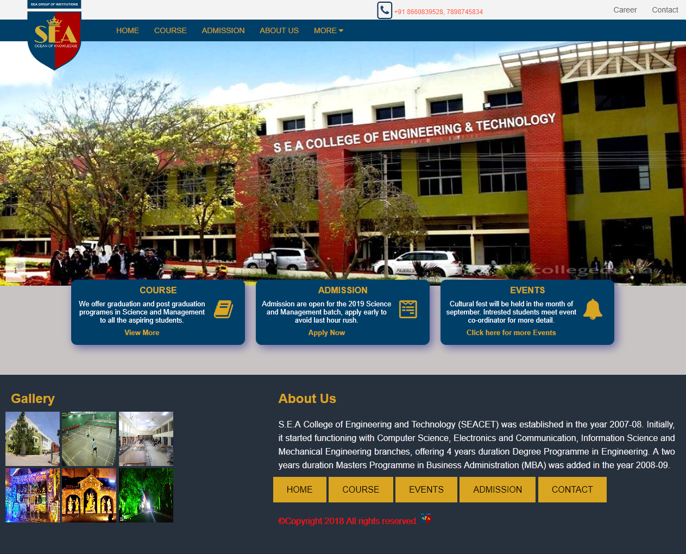

# S.E.A-college    

S.E.A College of Engineering and Technology website.

### Home page

## Contributing 
I would highly appriciate any update in form of code or any possible help towards the project.

